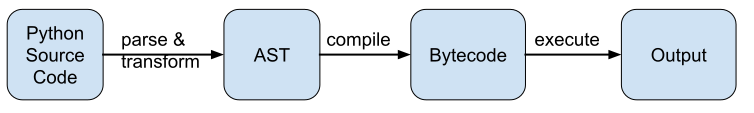

template: titleslide

# Python for HPC

---


# Python for HPC

These 3 lectures will cover:
- The role of Python in HPC

- How Python works "under the hood"

- When and why Python is slow (compared to compiled C/C++/Fortran)

- Strategies for fast numerical computing with Python 

- Parallel computing with Python

---

template: titleslide
# The role of Python in HPC

---

name:questionpython
# Python for HPC?


Python is popular...
 - Easy to use and flexible (concise and minimal syntax )
 - Dynamic variable typing
 - Automatic memory management
 - Allows imperative, functional, object-oriented & procedural programming
 - Wide range of third-party scientific/numerical packages available

...but how about in HPC?


---

name:questionpython
# Python for HPC?

Programming language usage on ARCHER (January 2018 - March 2019)**\***:

.center[]

**\*only reflects applications run using parallel job launcher**

So Python not really used to run parallel workloads in an HPC context...

---

template: questionpython
...*or is it?*

---

# Python for HPC?

2018 Gordon Bell Prize: "Exascale Deep Learning for Climate Analytics"

- Ran **TensorFlow** on Summit (Top500 #1, Nov. 2018) 
- Distributed across 27360 V100 GPUs using **Horovod** over MPI
- Sustained 0.3 exaflop/s (single precision) @ 90% parallel efficiency

But is this massively-parallel computing with Python?

.center[yes and no:]

.center[]

.center[]

---

# Python for HPC?

- Core compute ("heavy lifting") in Tensorflow done in C++ (and CUDA)

- Python does "everything else":
 - data preprocessing
 - formulating model
 - data staging & distribution
 - postprocessing / analysis of results
 - visualisation

This is typical for usage of Python in HPC:
- Acts as convenient "glue" tying different stages of workflow together
- Calls non-Python code for fast execution of performance-critical kernels

---

# Does Python performance matter?

Is it worth trying to understand Python performance programming? (Yes!)

- Python components in an HPC application may be tightly coupled with core non-Python compute code, essential to know how to use Python efficiently to avoid it becoming a bottleneck to good overall performance

- Want to understand how to exploit full numerical computing power of Python before deciding to call out to other code or employ other strategies

- Want to know what the options are for improving performance so we can choose a suitable strategy for our problem

- Why write slow code when you can write fast code, sometimes without much more effort? 

---


template: titleslide
# How Python works


---

name:howpythonworks
# How Python works

To understand performance, first understand how Python works:

Python code executed by a Python interpreter 
 - Typically **CPython** ("`python`") - Python reference implementation

The interpreter acts as:
 - *Parser*: turns Python code into abstract syntax tree (*AST*) representation
 
 - *Compiler*: produces bytecode (instructions &  data) from the *AST* 
   - like compiled language object files, but not directly executable by CPU
 
 - *Virtual machine*: executes bytecode on the underlying hardware

.center[]

---

# Example
Source code:
```Python
x = a + b
```

Abstract syntax tree:
```Python
>>> import ast
>>> myAST = ast.parse("x = a + b")
>>> ast.dump(myAST)
Module(
    body=[
        Assign(
            targets=[Name(id='x', ctx=Store())],
            value=BinOp(
                left=Name(id='a', ctx=Load()),
                op=Add(),
                right=Name(id='b', ctx=Load())))])
 
```

---

# Example

Bytecode:
```Python
>>> myBytecode = compile("x = a + b", "errorFilename", mode='exec')
>>> myBytecode.co_code
 b'e\x00e\x01\x17\x00Z\x02d\x00S\x00'
>>> import dis
>>> dis.dis(myBytecode)
  1           0 LOAD_NAME                0 (a)
              2 LOAD_NAME                1 (b)
              4 BINARY_ADD
              6 STORE_NAME               2 (x)
              8 LOAD_CONST               0 (None)
             10 RETURN_VALUE

```
Execution:
```Python
>>> a,b = 2,3
>>> exec(myBytecode)
>>> x
5

```

---

# The Python virtual machine / interpreter

- CPython implements a Python virtual machine in C
  - Python built-in object types (ints, floats, Lists) all implemented in C

- Execution of bytecode instructions by interpreter starts in giant `switch` statement: 
  - https://github.com/python/cpython/blob/master/Python/ceval.c

- Stack-based execution:
  - Function call: frame pushed onto call stack (incl. local variables)
  - Function's operations executed as frames on its evaluation stack
  - Function call returns: frame popped off call stack (return value popped onto prior frame's evaluation stack, if it exists)
  - Each frame has block stack to track control flow (e.g. loops)
  - References to objects stored on stack, object data stored on heap


---

template:titleslide
# Python performance

---

# CPython performance 

- Everything is an object:
  - Metadata (attributes), bookkeeping, unboxing & boxing overheads

- Dynamic typing and flexible object modification:
  - Need frequent type checking and lookups

- Function calls costly
  - Each call creates stack frame
  - Inlining difficult due to flexible function modification

- Loops and conditional blocks have high entry & exit overheads

- Local-scope variables faster to access than global-scope 

- Garbage collection based on global reference counter 

---

# CPython optimisations

CPython parser, AST builder, and bytecode compiler perform some basic optimisations:

- Bytecode is saved in file (`*.pyc` or in `__pycache` directory) for reuse

- "Peephole" optimiser
  - Constant unfolding (precompute constant arithmetic operations at compile time)
  - Dead code elimination (avoid unnecessary execution)
  - Some removal/optimisation of useless/conditional jumps
  - Simplification of conditionals

Very limited compared to Fortran/C/C++ compilers
 - Dynamic typing prevents many possible type-specific optimisations 
 - No assumed view of whole code prevents whole-program (e.g. interprocedural) optimisations 

Also intentional: code should execute straight away, don't want to spend time optimising

---

# CPython performance

- Generally, Python code executed as dynamically-compiled bytecode instructions by the CPython interpreter is slower
than ahead-of-time-compiled Fortran/C/C++ code

- For better performance, check if desired functionality is available in standard CPython library modules or external packages
  - Functions implemented as extensions to CPython written in C instead of in Python can be *much* faster

- What about performance in numerical computing specifically?

---

# Numerical computing

Care about performance of (nested) for loops reading/writing to/from arrays of floats/doubles
- Often performing same operation on all elements (individually, pairwise, or across >2 arrays)
- Explicit `for` loops in Python have very significant overhead:
  - type checking done for each element (even though all elements of an array of same type)
  - array operations are *not* vectorised by CPython

Data structures: standard Python Library provides lists and 1d arrays (type `array.array`)
 - Lists are general containers for objects
 - `array.array` is 1D list-like container for objects of the same type
 - Limited functionality for numerics
 - Significant memory and performance overhead associated with these structures - ** do not use these arrays for numerical computing **


---

# NumPy

For numerical computing, use (at least) the Numpy package

NumPy ("Numeric Python") provides:
  - Statically typed, fixed-size multidimensional arrays (matrices) - type `numpy.ndarray`
    - Like C arrays wrapped in Python objects
  - Linear algebra operations, random number generation
  - Fourier transforms, polynomials
  - Tools for integrating with Fortran/C (more about this later)
  - Fast precompiled functions for numerical routines
  - Efficient storage (contiguously in memory) and execution

https://docs.scipy.org/doc/numpy/user/whatisnumpy.html

Numpy can perform vectorised operations on all elements of arrays *with a single function call*
  - Drastically reduces overheads compared to running everything through the Python VM
    - Unless you write explicit `for` loops iterating over NumPy arrays

---

# Measuring Python performance

Python has a convenient timing function called `timeit`.

Can use this to measure the execution time of small code snippets.

- From python: `import timeit` and supply code snippet as a string
- From ipython: can use magic command `%timeit`

By default, `%timeit` repeats calling the timeit function 3 times and outputs the best time. It also tells you how many iterations it ran the code per repeat. You can specify the number of repeats and the number of iterations per repeat.

`%timeit -n <iterations> -r <repeats>  <code_snippet>`

---

# NumPy array access syntax & performance

Array access syntax matters for performance:

```Python
# Creating a 2D array
nd = numpy.arange(100).reshape((10,10))

# accessing element of 2D array
%timeit nd[5][4]      
304 ns ± 10.5 ns per loop (mean ± std. dev. of 7 runs, 1000000 loops each)

%timeit nd[5,4]
136 ns ± 3.78 ns per loop (mean ± std. dev. of 7 runs, 10000000 loops each)
```

The second case is more efficient as in the first case a new temporary array is created after the first index, and is subsequently indexed by `4`

---

# NumPy array performance

Consider the dot product of a vector with itself:

```Python
size = 1000000
x = numpy.arange(size)

# For loop explicitly multiplying all vector element pairs
%timeit for i in numpy.arange(size): x[i]**2
333 ms ± 2.64 ms per loop (mean ± std. dev. of 7 runs, 1 loop each)

# Vectorisation - with explicit reference to formed vector
%timeit x**2
1.08 ms ± 38.6 µs per loop (mean ± std. dev. of 7 runs, 1000 loops each)

# Using the dot product function 
%timeit numpy.dot(x,x)
402 µs ± 9.02 µs per loop (mean ± std. dev. of 7 runs, 1000 loops each)

```

---

# NumPy array performance

- Avoid explicit `for` loops, call named (precompiled) NumPy functions instead - likely to be fastest

- For elementwise operations with NumPy arrays, if no obvious dedicated function call, use overloaded operators (`+`, `-`, `*`, `/`, `**`) and related [`ufuncs`](https://numpy.org/devdocs/reference/ufuncs.html) ("universal functions") to achieve at least partial benefit of out-of-Python-stack execution of optimised machine code compiled from C

---

# NumExpr 

NumExpr can speed up evaluation of NumPy array expressions

```Python
# Using ufuncs
%timeit 2*x + x**2
3.44 ms ± 152 µs per loop (mean ± std. dev. of 7 runs, 100 loops each)

# Using NumExpr
import numexpr
%timeit numexpr.evaluate("2*x + x**2")
890 µs ± 28.1 µs per loop (mean ± std. dev. of 7 runs, 1000 loops each)

# Faster than x**2 but slower than numpy.dot(x,x)
%timeit numexpr.evaluate("x**2")
791 µs ± 11.3 µs per loop (mean ± std. dev. of 7 runs, 1000 loops each)
```

---

# NumExpr

How does this work?

- To evaluate `2*x + x**2` NumPy uses three temporary arrays as large as x
  - if `x` large, intermediate results of `2*x` and `x**2` not in cache

- NumExpr:
  - tries to avoid allocating memory for intermediate results
  - splits arrays & operands into chunks that fit easily into cache
  - provides its own virtual machine that can make use of vectorisation to evaluate chunks

- Also supports multithreading


---

# SciPy

- NumPy provides arrays and some linear algebra functionality

- SciPy builds on NumPy and provides additional modules:
 - Linear Algebra and wrappers to LAPACK & BLAS scipy.linalg
 - Numerical Integration scipy.integrate
 - Interpolation scipy.interpolate
 - Optimisation scipy.optimize
 - Special functions scipy.special
 - Signal processing scipy.signal
 - Image Processing scipy.ndimage
 - Fourier transforms scipy.fftpack
 - Statistical functions stats
 - Spatial data structures and algorithms scipy.spatial
 - File I/O scipy.io 

---

# Some other packages

- Pandas: R-like statistical analysis of numerical tables and time series
- SymPy: Python library for symbolic computing
- scikit-image: Advanced image processing
- scikit-learn: Package for machine learning
- Sage: Python alternative to Mathematica / Maple / Matlab


---
# Performance of Python packages

- SciPy and many other numerical packages in the Python ecosystem ultimately rely on NumPy for performance

- When NumPy is built it can be linked to high-performance maths libraries 

- e.g. on ARCHER:

```
numpy_show_config()
lapack_opt_info:
    libraries = ['sci_gnu', 'sci_gnu', 'sci_gnu']
    library_dirs = ['/opt/cray/libsci/13.0.1/GNU/49/sandybridge/lib']
    language = f77
blas_opt_info:
    libraries = ['sci_gnu', 'sci_gnu', 'sci_gnu']
    library_dirs = ['/opt/cray/libsci/13.0.1/GNU/49/sandybridge/lib']
    language = f77
openblas_info:
    libraries = ['sci_gnu', 'sci_gnu']
    library_dirs = ['/opt/cray/libsci/13.0.1/GNU/49/sandybridge/lib']
    language = f77
openblas_lapack_info:
    libraries = ['sci_gnu', 'sci_gnu']
    library_dirs = ['/opt/cray/libsci/13.0.1/GNU/49/sandybridge/lib']
    language = f77
```

---
# More speed?

What if we need more speed?  What options do we have?

- First figure out what is slow
 - Profiling

- Couple Python to existing code in another language 
 - Typically interface with C, C++ or Fortran
 - More benefits than just speed
 - Many ways of doing this, e.g. ctypes, f90wrap, cffi
 
- Just-in-time (JIT) compilation for Python
 - Numba
 - PyPy

- Write Python-like code that compiles into a C library using Cython

We are going to look at some of these, and try some in the practicals 

---

template: titleslide
# Profiling

---

# Profiling

- `cProfile`
 - standard, built in, reasonably low overhead
 - only gives information about function calls


- `line_profiler`
 - more detailed information, profile a function or set of functions,
 - can get a statement-by-statement breakdown
 - https://github.com/rkern/line_profiler

---

# cProfile

Can profile a snippet of code as follows:

```Python
import cProfile
cProfile.run('myCode')
```
or alternatively profile a Python script:

```bash
$ python -m cProfile  myScript.py
```

This returns the following columns:

```
ncalls  tottime  percall  cumtime  percall filename:lineno(function)
```
---

template: titleslide
# Interfacing with C/C++/Fortran

---

# Why couple Python with another language?


- Combine performance of compiled codes with flexibility of Python
 - Accelerate code where Python is slow
 - Incorporate Python analysis and visualisation into existing codebase
 - Provide flexible way to extract results from code using Python
 - Reuse code that you already have

- Gradually introduce new functionality using Python

- There are a number of ways to do this (quite a large number)
 - One way or another might suit your needs
 - All doing essentially the same thing


---

# Importing modules from shared libraries


- Basic approach is to compile a shared library
 - Compile function code written in e.g. C/C++/Fortran into optimised machine code stored in shared library
 - Describe the interface to this library to Python
- Requires
 - Appropriate compiler (e.g., gfortran, gcc, ...)
 - Usually compile with `-fPIC` (Position Independent Code)
- Produces
 - Shared library (.so in Unix; DLLs in Windows) to load at run time
 - Some approaches use usual Python module `import` command 
- Some care may be required with compound/opaque data types
 - Need a clear picture of the number of types of any arguments

---

# Coupling Python and C using `ctypes`

- `ctypes` is a Python standard library module
 - Provides utilities to describe C-compatible data types
 - Manipulation of shared libraries/DLLs
 - Uses only Python (no additional files/mixed-language intermediate code)
```Python
import ctypes
```
- Must load the library (.so) file explicitly
```Python
lib = ctypes.cdll.LoadLibrary("./my_library.so")
```
- Must specify the prototype for the C function, e.g.,
```Python
# Result type
lib.my_c_function.restype = ctypes.c_int
# Argument list
lib.my_c_function.argtypes = [ctypes.c_double]
```
- Potentially error-prone
---

# `ctypes` example: C side

Consider the simple function:
```C
int my_c_function(double val) {

    return (int) (val + 1.0);
}
```
We need to compile a shared library:
```
$ gcc -c -fPIC my_library.c
$ gcc -shared -o my_library.so my_library.o

```

---

# `ctypes` example: Python side

Once we have the shared library:
```Python
import ctypes

lib = ctypes.cdll.LoadLibrary("./my_library.so")

# Define return type ...
lib.my_c_function.restype = ctypes.c_int

# ...and the argument list
lib.my_c_function.argtypes = [ctypes.c_double]

x = 23.0
result = lib.my_c_function(x)
print(result, type(result))
```
`24 <class 'int'>`

---

# Arrays

Consider the following example in C with two pointer arguments:
```C
#include <math.h>

void array_sqrt(int n, double * a_in, double * a_out) {

  int i;

  for (i = 0; i < n; i++) {
    a_out[i] = sqrt(a_in[i]);
  }

  return;
}
```
Generate the shared library as before:
```
$ gcc -c -fPIC c_sqrt.c
$ gcc -shared -o c_sqrt.so c_sqrt.o
```

---

# Using `ctypes` for array pointers

```Python
# We need a pointer type p_double
# Use ctypes utility function POINTER()

import ctypes

c_int = ctypes.c_int
c_double = ctypes.c_double
p_double = ctypes.POINTER(c_double)

liba = ctypes.cdll.LoadLibrary("./c_sqrt.so")

liba.array_sqrt.restype = None
liba.array_sqrt.argtypes = [c_int, p_double, p_double]
```

---

# Using `ctypes` for array pointers

How do we extract something that looks like a C pointer from a numpy array?

```Python
import numpy as np

# Define some test data as numpy arrays

a_in = np.array([16.0, 25.0, 36.0, 49.0])
a_out = np.zeros(4, np.double)

# Then we need to pass pointers to actual data
pin  =  a_in.ctypes.data_as(p_double)
pout = a_out.ctypes.data_as(p_double)

liba.array_sqrt(4, pin, pout)
print(a_out)
```

`[4. 5. 6. 7.]`


---

# Using `numpy.ctypeslib`

Couldn't we just pass the NumPy `ndarray` as it is?

Yes:

```Python
from numpy.ctypeslib import ndpointer

libb = ctypes.cdll.LoadLibrary("./c_sqrt.so")

# Describe a_in, a_out
ndarg = ndpointer(ctypes.c_double, flags = "C_CONTIGUOUS")

libb.array_sqrt.restype = None
libb.array_sqrt.argtypes = [c_int, ndarg, ndarg]

# A new output array
a_out = np.zeros(4, np.double, order = 'C')

libb.array_sqrt(4, a_in, a_out)
print(a_out)
```
`[4. 5. 6. 7.]`

---

# Alternative interfacing approaches

Can use `ctypes` to interface with C++ or Fortran
 - f90wrap more natural for Fortran (or f2py for old Fortran - F77)

C foreign function interface (CFFI) 
 - Can load shared library directly (ABI approach)...
   - Load shared library
   - Decribe C function prototypes
 - ... or deal with C code (API approach)
   - Provide prototypes and link to source code
   - Compile from Python
   - Import resulting Python module
 - Compatible with PyPy

---

# Next

- Next lecture will cover Cython, PyPy and Numba

- First practical will give you a chance to experiment improving Python performance using approaches from this lecture (and the next)

