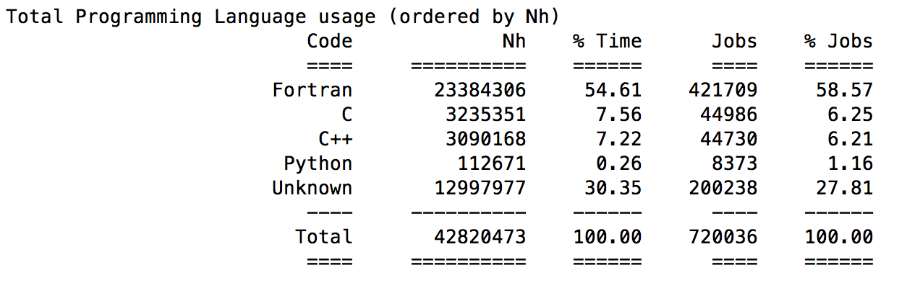
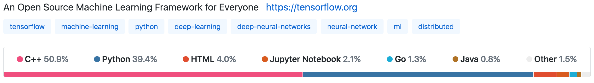
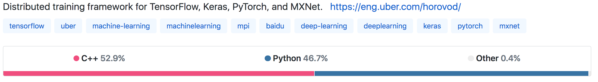

template: titleslide

# Python for HPC


---


# Python for HPC

These 3 lectures will cover:
- Brief overview of Python characteristics

- The role of Python in HPC
 - Usage, benefits, limitations

- Performance programming with Python
 - Obtaining good performance for numerical computing

- Parallel computing with Python

---

# Python characteristics - brief overview

- Python code - script or interactive commands  - usually executed by the standard Python interpreter (CPython implementation)

- Interpreter converts Python code to intermediate bytecode, which is executed by the Python virtual machine

- *Easy to use and flexible*:
 - dynamic variable typing
 - automatic memory management
 - imperative, functional, object-oriented & procedural programming
 - wide range of add-on scientific/numerical packages available
 
---

# Python characteristics - consequences

However...

- Normally no ahead-of-time compilation to machine code prior to execution
 - No opportunity for many of the performance optimisations that exist for compiled languages like C, C++, Fortran

- Dynamic typing prevents optimisations possible when type is known in advance, and requires continuous type checking at runtime

- Normally also no just-in-time (JIT) compilation

It is no surprise that Python's characteristics predispose it to lower performance than traditional HPC languages

---

template: titleslide
# The role of Python in HPC

---

name:questionpython
# Python for HPC?

Python is everywhere... how about in HPC?

Programming language usage on ARCHER (January 2018 - March 2019)**\***:

.center[]

**\*only reflects applications run using parallel job launcher**

So Python not really used to run parallel workloads in an HPC context...

---
template: questionpython
...*or is it?*

---

# Python for HPC?

2018 Gordon Bell Prize: "Exascale Deep Learning for Climate Analytics"

- Ran **TensorFlow** on Summit (Top500 #1, Nov. 2018) 
- Distributed across 27360 V100 GPUs using **Horovod** over MPI
- Sustained 0.3 exaflop/s (single precision) @ 90% parallel efficiency

But is this massively-parallel computing with Python?

.center[yes and no:]

.center[]

.center[]

---

# Python for HPC?

- Core compute ("heavy lifting") in Tensorflow done in C++ (and CUDA)

- Python does "everything else":
 - data preprocessing
 - formulating model
 - data staging & distribution
 - postprocessing / analysis of results
 - visualisation

This is typical for usage of Python in HPC:
- Acts as an easy-to-use bridge / glue code tying everything together
- Calls out to other code for fast execution of performance-critical kernels
- Convenient for general-purpose computing as well as large variety of numerical and data-oriented functionalities available as packages

---

# Does Python performance matter?

Is it worth trying to understand Python performance programming? (Yes!)

- Python components in an HPC application may be tightly coupled with core non-Python compute code, essential to know how to use Python efficiently to avoid it becoming a bottleneck to good overall performance

- Want to understand how to exploit full numerical computing power of Python before deciding to call out to other code or employ other strategies

- Want to know what the options are for improving performance so we can choose a suitable strategy for our problem

- Why write slow code when you can write fast code, sometimes without much more effort? 

---

template: titleslide
# Python performance programming for numerical computing

---

# Introducing NumPy

- NumPy ("Numeric Python") supports:
 - Multidimensional arrays
 - Matrices and linear algebra operations
 - Random number generation
 - Fourier transforms
 - Polynomials
 - Tools for integrating with Fortran/C (more about this later)
 - NumPy provides fast precompiled functions for numerical routines

https://docs.scipy.org/doc/numpy/user/whatisnumpy.html

---

# Python performance programming

- Standard Python Library provides lists and 1d arrays (type array.array)
 - Lists are general containers for objects
 - Arrays are 1D containers for objects of the same type
 - Limited functionality
 - Some memory and performance overhead associated with these structures - ** do not use these arrays for numerical computing **

- NumPy provides general-dimensional arrays (type numpy.ndarray)
 - Can store many elements of the same data type in multiple dimensions
 - Like C arrays wrapped in Python objects
 - More functionality than core Python e.g. many convenient methods for array manipulation
 - Efficient storage (contiguously in memory) and execution


---

# Measuring Python performance

Python has a convenient timing function called `timeit`.

Can use this to measure the execution time of small code snippets.

- From python: `import timeit` and supply code snippet as a string
- From ipython: can use magic command `%timeit`

By default, `%timeit` repeats calling the timeit function 3 times and outputs the best time. It also tells you how many iterations it ran the code per repeat. You can specify the number of repeats and the number of iterations per repeat.

`%timeit -n <iterations> -r <repeats>  <code_snippet>`

---

# NumPy array performance

Array access syntax matters for performance:

```Python
# Creating a 2D array
nd = numpy.arange(100).reshape((10,10))

# accessing element of 2D array
%timeit nd[5][4]      
304 ns ± 10.5 ns per loop (mean ± std. dev. of 7 runs, 1000000 loops each)

%timeit nd[5,4]
136 ns ± 3.78 ns per loop (mean ± std. dev. of 7 runs, 10000000 loops each)
```

The second case is more inefficient as in the first case a new temporary array is created after the first index, and is subsequently indexed by `4`

---

# NumPy array performance

Consider the dot product of a vector with itself:

```Python
size = 1000000
%timeit x = numpy.arange(size)
23.8 ms ± 1.01 ms per loop (mean ± std. dev. of 7 runs, 10 loops each)

# For loop explicitly multiplying all vector element pairs
%timeit for i in numpy.arange(size): x[i]**2
5.78 s ± 245 ms per loop (mean ± std. dev. of 7 runs, 1 loop each)

# For loop using knowledge of what generated the vector elements
%timeit for element in numpy.arange(size): element**2
330 ms ± 4.13 ms per loop (mean ± std. dev. of 7 runs, 1 loop each)

# Vectorisation - with explicit reference to formed vector
%timeit x**2
27 ms ± 1.08 ms per loop (mean ± std. dev. of 7 runs, 10 loops each)

# Vectorization - using knowledge of what generated the vector elements
%timeit numpy.arange(size)**2
5.41 ms ± 210 µs per loop (mean ± std. dev. of 7 runs, 100 loops each)
```

Explicit for loops often not the fastest way to arrive at the same answer

---
# NumPy performance - continued

Often fastest to find the right precompiled function:

```Python
size = 1000000
%timeit x = numpy.arange(size)
23.8 ms ± 1.01 ms per loop (mean ± std. dev. of 7 runs, 10 loops each)

# Using the dot product function 
%timeit numpy.dot(x,x)
3.77 ms ± 57.1 µs per loop (mean ± std. dev. of 7 runs, 100 loops each)

```

---

# SciPy

- NumPy provides arrays and some linear algebra functionality

- SciPy builds on NumPy and provides additional modules:
 - Linear Algebra and wrappers to LAPACK & BLAS scipy.linalg
 - Numerical Integration scipy.integrate
 - Interpolation scipy.interpolate
 - Optimisation scipy.optimize
 - Special functions scipy.special
 - Signal processing scipy.signal
 - Image Processing scipy.ndimage
 - Fourier transforms scipy.fftpack
 - Statistical functions stats
 - Spatial data structures and algorithms scipy.spatial
 - File I/O scipy.io 

---

# Some other packages

- Pandas: R-like statistical analysis of numerical tables and time series
- SymPy: Python library for symbolic computing
- scikit-image: Advanced image processing
- scikit-learn: Package for machine learning
- Sage: Python alternative to Mathematica / Maple / Matlab


---
# Performance of Python packages

- SciPy and many other numerical packages in the Python ecosystem ultimately rely on NumPy for performance

- When NumPy is built it can be linked to high-performance maths libraries 

- e.g. on ARCHER:

```
numpy_show_config()
lapack_opt_info:
    libraries = ['sci_gnu', 'sci_gnu', 'sci_gnu']
    library_dirs = ['/opt/cray/libsci/13.0.1/GNU/49/sandybridge/lib']
    language = f77
blas_opt_info:
    libraries = ['sci_gnu', 'sci_gnu', 'sci_gnu']
    library_dirs = ['/opt/cray/libsci/13.0.1/GNU/49/sandybridge/lib']
    language = f77
openblas_info:
    libraries = ['sci_gnu', 'sci_gnu']
    library_dirs = ['/opt/cray/libsci/13.0.1/GNU/49/sandybridge/lib']
    language = f77
openblas_lapack_info:
    libraries = ['sci_gnu', 'sci_gnu']
    library_dirs = ['/opt/cray/libsci/13.0.1/GNU/49/sandybridge/lib']
    language = f77
```

---
# More speed?

What if we need more speed?  What options do we have?

- First figure out what is slow
 - Profiling

- Couple Python to existing code in another language 
 - Typically interface with C, C++ or Fortran
 - More benefits than just speed
 - Many ways of doing this, e.g. ctypes, f90wrap, cffi
 
- Just-in-time (JIT) compilation for Python
 - Numba
 - PyPy

- Write Python-like code that compiles into a C library using Cython

We are going to look at some of these, and try some in the practicals 

---

template: titleslide
# Profiling

---

# Profiling

- `cProfile`
 - standard, built in, reasonably low overhead
 - only gives information about function calls only


- `line_profiler`
 - more detailed information, profile a function or set of functions,
 - can get a statement-by-statement breakdown
 - https://github.com/rkern/line_profiler

---

# cProfile

Can profile a snippet of code as follows:

```Python
import cProfile
cProfile.run('myCode')
```
or alternatively profile a Python script:

```bash
$ python -m cProfile  myScript.py
```

This returns the following columns:

```
ncalls  tottime  percall  cumtime  percall filename:lineno(function)
```
---

template: titleslide
# Interfacing with C/C++/Fortran

---

# Why couple Python with another language?


- Combine performance of compiled codes with flexibility of Python
 - Accelerate code where Python is slow
 - Incorporate Python analysis and visualisation into existing codebase
 - Provide flexible way to extract results from code using Python
 - Reuse code that you already have

- Gradually introduce new functionality using Python

- There are a number of ways to do this (quite a large number)
 - One way or another might suit your needs
 - All doing essentially the same thing


---

# Importing modules from shared libraries


- Basic approach is to compile a shared library
 - Compiles native language source
 - Describe the interface to Python
- Requires
 - Appropriate compiler (e.g., gfortran, gcc, ...)
 - Usually `-fPIC` (Position Independent Code)
- Will produce
 - A shared library (.so in Unix; DLLs in Windows) to be loaded at run time
 - Some approaches `import` module as usual
- Some care may be required with compound/opaque data types
 - Need a clear picture of the number of types of any arguments

---

# Coupling Python and C using `ctypes`

- `ctypes` is a Python standard library module
 - Provides utilities to describe C-compatible data types
 - Manipulation of shared libraries/DLLs
 - Uses only Python (no additional files/mixed-language intermediate code)
```Python
import ctypes
```
- Must load the library (.so) file explicitly
```Python
lib = ctypes.cdll.LoadLibrary("./my_library.so")
```
- Must specify the prototype for the C function, e.g.,
```Python
# Result type
lib.my_c_function.restype = ctypes.c_int
# Argument list
lib.my_c_function.argtypes = [ctypes.c_double]
```
- Potentially error-prone
---

# `ctypes` example: C side

Consider the simple function:
```C
int my_c_function(double val) {

    return (int) (val + 1.0);
}
```
We need to compile a shared library:
```
$ gcc -c -fPIC my_library.c
$ gcc -shared -o my_library.so my_library.o

```

---

# `ctypes` example: Python side

Once we have the shared library:
```Python
import ctypes

lib = ctypes.cdll.LoadLibrary("./my_library.so")

# Define return type ...
lib.my_c_function.restype = ctypes.c_int

# ...and the argument list
lib.my_c_function.argtypes = [ctypes.c_double]

x = float(23)
result = lib.my_c_function(x)
print(result, type(result))
```
`24 <class 'int'>`

---

# Arrays

Consider the following example in C with two pointer arguments:
```C
#include <math.h>

void array_sqrt(int n, double * a_in, double * a_out) {

  int i;

  for (i = 0; i < n; i++) {
    a_out[i] = sqrt(a_in[i]);
  }

  return;
}
```
Generate the shared library as before:
```
$ gcc -c -fPIC c_sqrt.c
$ gcc -shared -o c_sqrt.so c_sqrt.o
```

---

# Using `ctypes` for array pointers

```Python
# We need a pointer type p_double
# Use ctypes utility function POINTER()

import ctypes

c_int = ctypes.c_int
c_double = ctypes.c_double
p_double = ctypes.POINTER(c_double)

liba = ctypes.cdll.LoadLibrary("./c_sqrt.so")

liba.array_sqrt.restype = None
liba.array_sqrt.argtypes = [c_int, p_double, p_double]
```

---

# Using `ctypes` for array pointers

How do we extract something that looks like a C pointer from a numpy array?

```Python
import numpy as np

# Define some test data as numpy arrays

a_in = np.array([16.0, 25.0, 36.0, 49.0])
a_out = np.zeros(4, np.double)

# Then we need to pass pointers to actual data
pin  =  a_in.ctypes.data_as(p_double)
pout = a_out.ctypes.data_as(p_double)

liba.array_sqrt(4, pin, pout)
print(a_out)
```

`[4. 5. 6. 7.]`


---

# Using `numpy.ctypeslib`

Couldn't we just pass the NumPy `ndarray` as it is?

Yes:

```Python
from numpy.ctypeslib import ndpointer

libb = ctypes.cdll.LoadLibrary("./c_sqrt.so")

# Describe a_in, a_out
ndarg = ndpointer(ctypes.c_double, flags = "C_CONTIGUOUS")

libb.array_sqrt.restype = None
libb.array_sqrt.argtypes = [c_int, ndarg, ndarg]

# A new output array
a_out = np.zeros(4, np.double, order = 'C')

libb.array_sqrt(4, a_in, a_out)
print(a_out)
```
`[4. 5. 6. 7.]`

---

# Alternative interfacing approaches

Can use `ctypes` to interface with C++ or Fortran
 - f90wrap more natural for Fortran (or f2py for old Fortran - F77)

C foreign function interface (CFFI) is standard library module
 - Can load shared library directly ("ABI")
 - Can deal with code ("API")

- Application binary interface
 - Load shared library
 - Decribe prototype

- Application programming interface
 - Provide prototype and source code
 - Compile from Python
 - Import resultant module

---

# Just-in-time compilation using Numba

- Numba uses a slightly different approach: just-in-time compilation (JIT)

- When a Numba function is called for the first time, function is compiled into machine code using LLVM (for the given argument types) and stored

- Subsequent calls with the same argument types use the machine code and are therefore very fast

- Inbuilt version of LLVM so no calls to external compiler/loading libraries

---

# Numba

Use `@jit` decorator to indicate functions for compilation:
- `@jit (nopython = True)`

```Python
import numpy as np
from numba import jit

@jit (nopython = True)
def array_sqrt(n, ain, aout):
    for i in range(n):
        aout[i] = np.sqrt(ain[i])

a_in  = np.array([4.0, 9.0, 16.0, 25.0], np.double)
a_out = np.zeros(4, np.double)

array_sqrt(a_in.size, a_in, a_out)
print(a_out)
```
`[2. 3. 4. 5.]`

---

# PyPy

- Numba adds JIT capability to the Python interpreter by leveraging LLVM

- PyPy is a JIT Python compiler created entirely separately from the standard Python interpreter
 - Aims to support all core Python, NumPy, and a few other packages but in practice can't guarantee completeness / compatibility

---

# Practical

- The first practical will give you a chance to experiment improving Python performance using approaches discussed today

- Next lecture will discuss Cython and start to look at parallel computing with Python
